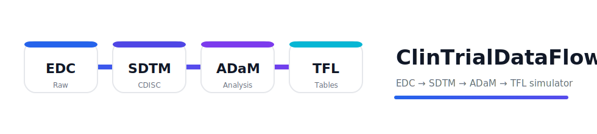

<p align="center">
  
</p>

<div align="center">

<!-- Replace with your logo once you have it -->
<!--  -->

**End-to-end clinical trial data simulation: EDC → SDTM → ADaM → TFL**  
with realistic imperfections and interactive workflows.

<br/>


</div>

---

## Why ClinTrialDataFlow

ClinTrialDataFlow is a reproducible simulator designed to mimic real-world
pharmaceutical clinical data workflows:

> **EDC / Raw → SDTM → ADaM → TFL**

It is intended for **education, method prototyping, QC stress-testing,
and technical demonstrations**, while ensuring that **no private or real
clinical data are used**.

---

## Features

- 🔬 **EDC / Raw data simulation**
  - Subjects, visits, exposure, laboratory data, adverse events, vitals
  - Oncology essentials: **TU** (Tumor Identification) and **RS** (Response)
- 📐 **SDTM generation**
  - DM, SV, AE, LB, VS, **TU**, **RS**, EX, DS
  - Directory-based input/output for transparency and debugging
- 📊 **ADaM derivation**
  - ADSL, ADRS, ADSLRS (**BOR / BORUNC / BORC**)
  - ADTTE with PFS / OS–ready time-to-event variables
- 📈 **TFL outputs**
  - Baseline characteristics
  - ORR (CR+PR) with confidence intervals
  - Kaplan–Meier summaries and plots (PFS / OS)
- 🧪 **Realistic data imperfections**
  - Dropout, missing forms/items, and query-like inconsistencies
- 🌐 **Interactive web application**
  - Run the full pipeline in a browser, preview datasets, and download outputs

---

## Project Structure

```text
ClinTrialDataFlow/
├── app.py                 # Streamlit web app (interactive runner)
├── cfg.json               # Simulation configuration
├── Codes/
│   ├── EDCSimu.py         # EDC / Raw data simulation
│   ├── SDTMSimu.py        # Raw → SDTM
│   ├── ADaMSimu.py        # SDTM → ADaM
│   └── TFLSimu.py         # ADaM → TFL
└── Data/
   ├── raw_out/
   ├── sdtm_out/
   ├── adam_out/
   └── tfl_out/
```

## 🚀 Quick Start

### Requirements

```bash
# Core dependencies
pip install pandas numpy matplotlib

# Interactive web app
pip install streamlit

# Optional: exact binomial CI for ORR (Clopper–Pearson)
pip install scipy
```

### Option A: Interactive Web App (Streamlit)

```bash
streamlit run app.py
```

The web interface allows you to:

- Edit and save `cfg.json`
- Run the full pipeline: EDC → SDTM → ADaM → TFL
- Preview key datasets
- Download outputs for each stage

### Option B: CLI Pipeline

From the repository root:

```bash
python Codes/EDCSimu.py  --cfg cfg.json --out Data/raw_out
python Codes/SDTMSimu.py --indir Data/raw_out --out Data/sdtm_out
python Codes/ADaMSimu.py --insdtm Data/sdtm_out --out Data/adam_out
python Codes/TFLSimu.py  --inadam Data/adam_out --out Data/tfl_out
```

---

> Configuration

Simulation behavior is controlled via `cfg.json`, including:
- Sample size
- Random seed
- Dropout mechanisms
- Form-level and item-level missingness
See `cfg.json` for details.

---

> Outputs

- RAW / EDC-like: EDC-style source tables intended to resemble raw clinical data capture.
- SDTM: CDISC SDTM domains suitable for downstream ADaM derivation.
- ADaM: Analysis-ready datasets including subject-level response summaries and time-to-event endpoints.
- TFL: Summary tables and figures commonly used in clinical study reports (e.g., baseline characteristics, ORR, PFS/OS).

---

> Design Notes

This project emphasizes clarity, reproducibility, and realism rather than regulatory validation. It is intended as a safe sandbox for learning, method development, and pipeline prototyping.
